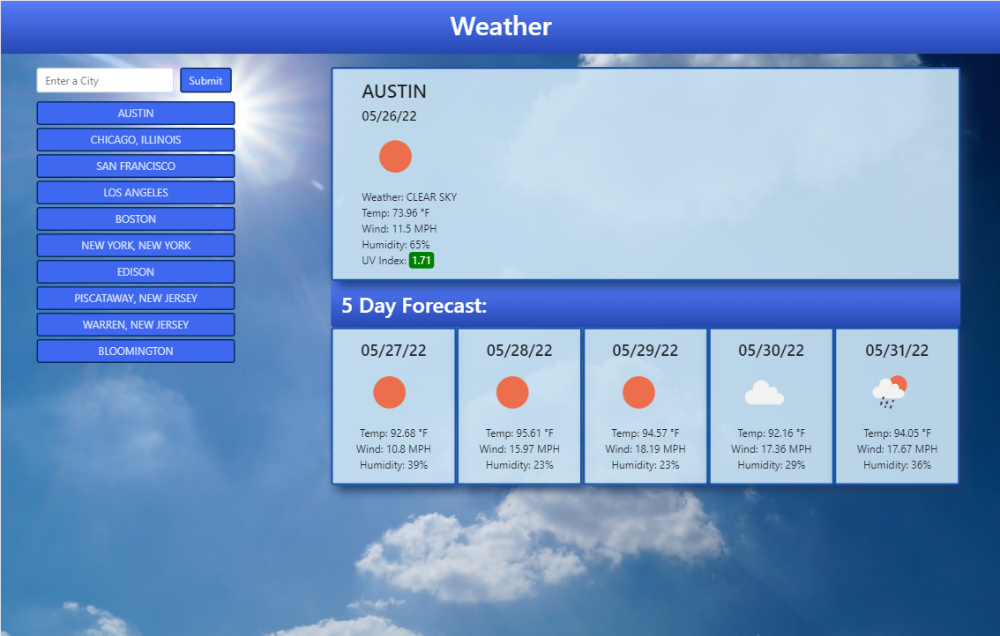

# Weather-Forecast
I created a weather app to display the current forecast and the forecast for the next five days.  I accomplished this by cleaning up the user inputted location, converting the state abbreviations if necessary, and then fetching the location data from Open Weather. Once I received the location information, I then fetched the weather data from Open Weather and Updated the page to represent the weather data.  Finally, I saved the last ten location entries into local storage for easy use.
## Link
The Weather Forcast app can be found [here](https://bthalpin.github.io/Weather-Forecast/)

## Media
The following image shows the layout of the weather app:

The folowing image shows the mobile layout:

